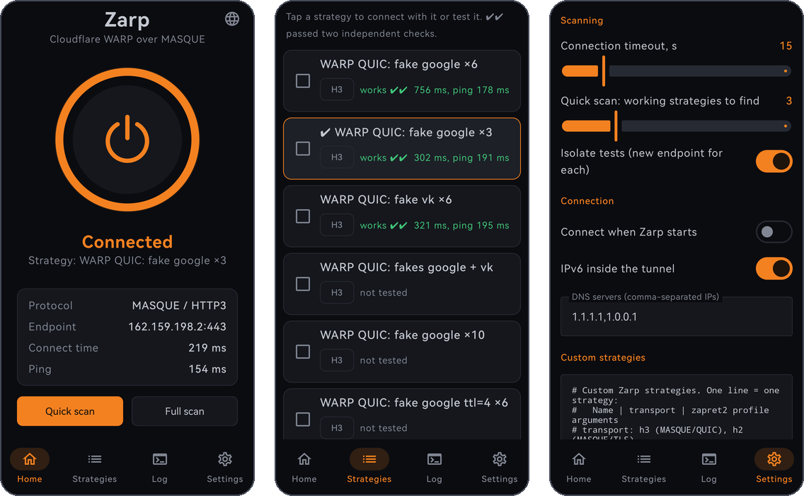

# Zarp for Android

[](https://github.com/feg55/Zarp-Android/actions/workflows/android.yml)
[](https://github.com/feg55/Zarp-Android/releases/latest)
[](LICENSE)

One-tap Cloudflare WARP for networks that block it. Android version of [Zarp](https://github.com/feg55/Zarp): it finds a strategy that gets the WARP handshake through DPI, checks it twice, remembers it and connects.



## Features

- **One button.** The first tap searches for the fastest working strategy, later taps connect right away.
- **No WARP app needed.** Zarp talks to WARP itself over MASQUE (HTTP/3, with HTTP/2 as a fallback) and registers a free WARP device on first use.
- **The same strategies as on Windows.** Fake QUIC Initials of google.com and vk.com are sent from the tunnel's own UDP socket right before the real handshake, so DPI sees them on the same connection.
- **Honest testing.** Each test runs on a fresh WARP endpoint and every candidate is checked twice. A strategy passes only if `cdn-cgi/trace` reports `warp=on`.
- **Self-healing.** If the saved strategy stops working, Zarp tries the other verified ones before searching again. After a network change it reconnects and applies the strategy again.
- **No root.** A regular Android VPN. Strategies that need raw sockets are shown as unsupported instead of being faked.
- **Your language.** English, Русский, Español, Português, 中文, हिन्दी, Français and Deutsch. Zarp follows the system language (English if it is not on the list), and the globe button switches it on the fly.

## Requirements

- Android 8.0 or later (arm64, armv7 or x86_64)

## Usage

1. Download the APK from [Releases](https://github.com/feg55/Zarp-Android/releases/latest) and install it.
2. Tap the power button. Accept the WARP terms and the VPN request the first time.
3. The first search takes about a minute. After that Zarp connects with the saved strategy.

The Strategies tab shows every strategy with its result. Tap one to connect with it or test it again, or tick several and test them together. **Quick scan** stops after 3 working strategies (adjustable in Settings), **Full scan** tests all of them.

> [!NOTE]
> Turn off any other VPN before a search. Android runs one VPN at a time, and a scan through someone else's tunnel measures that tunnel, not your network.

## Strategies

| Strategy | Transport | Android |
|---|---|---|
| fake google ×3 / ×6 / ×10, fake vk ×6, fakes google + vk | MASQUE / HTTP3 | yes |
| fake google / vk ttl=4 ×6 | MASQUE / HTTP3 | yes, TTL is lowered for the fakes only |
| fake google badsum ×6 | MASQUE / HTTP3 | no, needs raw sockets |
| split 1,midsld and disorder 1,midsld | MASQUE / HTTP2 | yes |
| fake md5, seqovl, badseq, hostfakesplit | MASQUE / HTTP2 | no, needs raw sockets |
| WireGuard strategies | WireGuard | not yet |
| Direct (no desync) | HTTP3 and HTTP2 | yes, the control test |

On one Russian home network the fake google and fake vk strategies connect in 150 to 300 ms, while a direct connection stalls right after the QUIC handshake. Results depend on the network, which is why Zarp tests instead of guessing.

Your own strategies go into Settings in the same format as the desktop `strategies.txt`:

```
# name | transport (h3, h2) | zapret2 profile args
My QUIC | h3 | --payload=quic_initial --lua-desync=fake:blob=quic_google:repeats=8
```

## How it works

```
apps -> VpnService (TUN) -> hev-socks5-tunnel -> SOCKS5 on 127.0.0.1 -> MASQUE core -> Cloudflare WARP
```

The MASQUE core is [usque](https://github.com/Diniboy1123/usque) built with gomobile. Before every QUIC dial the core asks the app for a UDP socket. The app creates it, sends the strategy's fake packets through it and hands the same socket back, and quic-go sends the real Initial from there. Zarp's own traffic is excluded from the VPN, so the tunnel never loops into itself.

A search runs each strategy on its own tunnel and endpoint and fetches `cdn-cgi/trace` through it. Score is `connect time + 4 × ping`, the same as on Windows. The fake packets are the real captures from [zapret2](https://github.com/bol-van/zapret2) (`files/fake`).

### Privacy

Zarp has no telemetry and does not collect personal data. It connects only to:

- `api.cloudflareclient.com`, once, to register a WARP device;
- WARP MASQUE endpoints (`162.159.198.1`, `162.159.198.2`), which carry the tunnel;
- `https://www.cloudflare.com/cdn-cgi/trace`, through the tunnel, to check WARP and measure latency.

WARP is covered by the [Cloudflare WARP privacy policy](https://www.cloudflare.com/application/privacypolicy/).

## Building

Needs JDK 17+, Go (version in `core/go.mod`) and the Android SDK with platform `android-37.0`, build-tools 36.1.0 and NDK 29.0.14206865.

```sh
git clone --recursive https://github.com/feg55/Zarp-Android
cd Zarp-Android
./gradlew test lint assembleDebug   # app/build/outputs/apk/debug/app-debug.apk
```

The Go core is built into `app/libs/zarpcore.aar` by the `buildGoCore` task; its own tests run with `cd core && go test ./zarpcore`. If `dl.google.com` is blocked for you, add `zarp.googleMirror=https://maven.aliyun.com/repository/google` to `local.properties`.

Debug builds install next to the release as "Zarp debug" and accept commands over adb, which is handy for testing strategies without tapping:

```sh
adb shell am broadcast -a io.github.feg55.zarp.DEBUG -n io.github.feg55.zarp.debug/io.github.feg55.zarp.DebugCommandReceiver --es cmd "'test warp-q-google6,direct'"
# quick | full | connect | disconnect | cancel | test <id,id> | use <id>
```

GitHub Actions builds every push. A `v*` tag builds a release APK signed with the key from the repository secrets and publishes it with its SHA-256.

### Translations

All strings live in [`app/src/main/assets/lang`](app/src/main/assets/lang), one `key = value` file per language with `en.txt` as the reference, in the same format as the desktop Zarp. Strings shared with the desktop app keep its keys and wording. The tests check that every language has the same keys and placeholders as English.

## License

GPL-3.0, see [LICENSE](LICENSE). The Windows Zarp stays under MIT.

Bundled components: [usque](https://github.com/Diniboy1123/usque) (MIT, vendored in `core/third_party/usque`), [hev-socks5-tunnel](https://github.com/heiher/hev-socks5-tunnel) (MIT), fake packets from [zapret2](https://github.com/bol-van/zapret2) (MIT), plus quic-go, connect-ip-go, wireguard-go and gVisor under their own licenses. License texts are in [`licenses`](licenses).

Cloudflare and WARP are trademarks of Cloudflare, Inc. Zarp is an independent project, not affiliated with or endorsed by Cloudflare.
